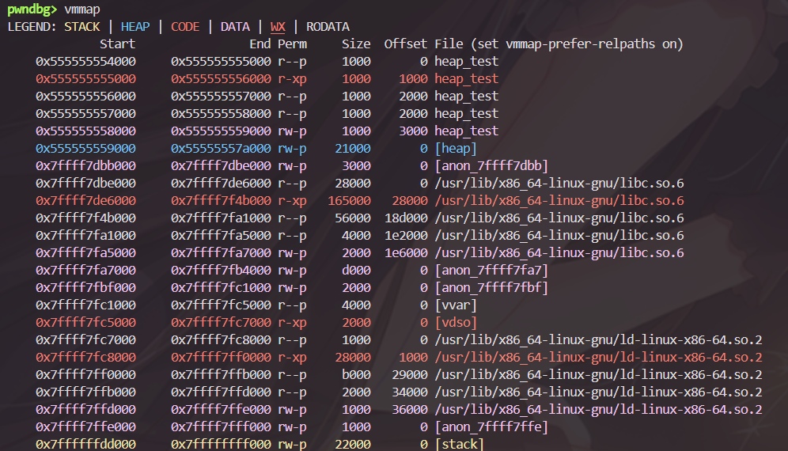
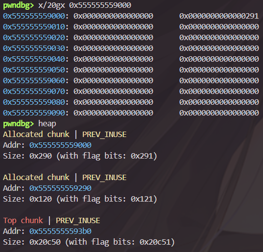
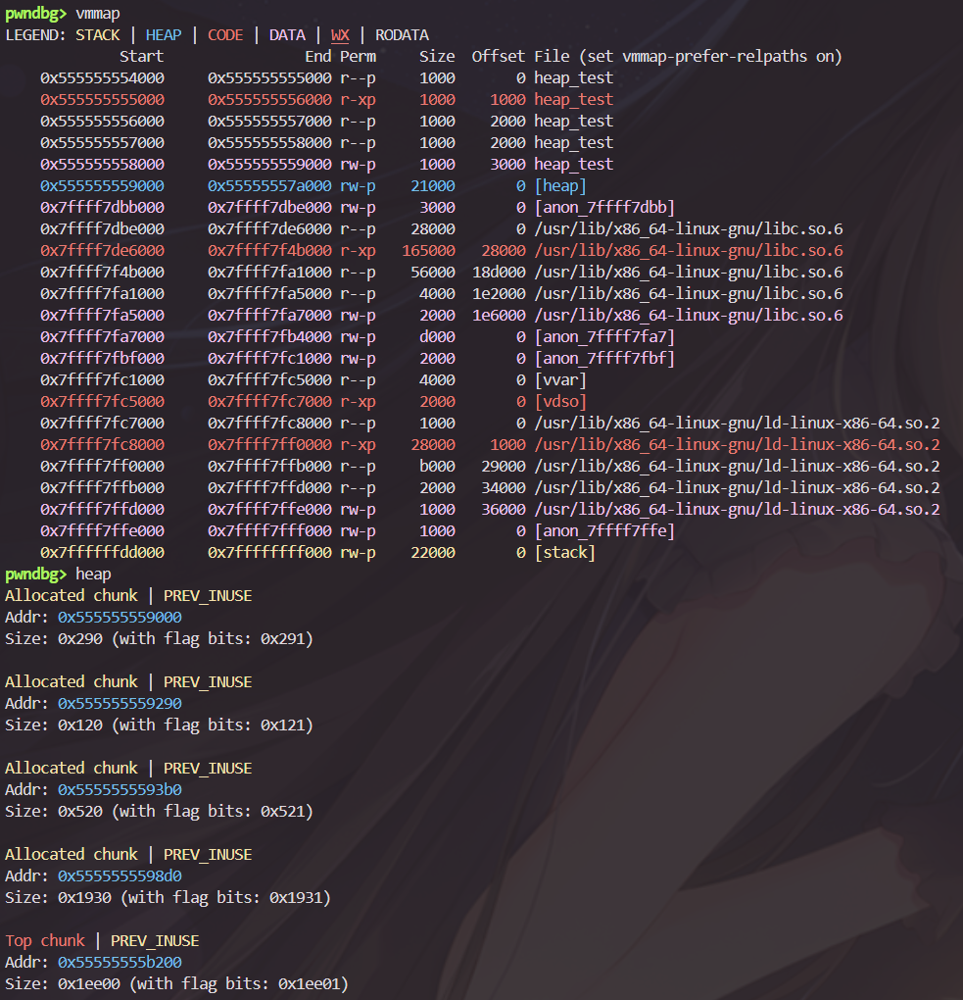
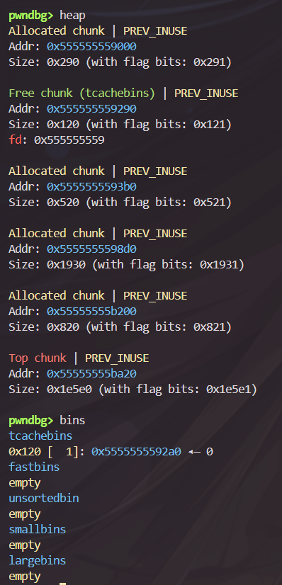
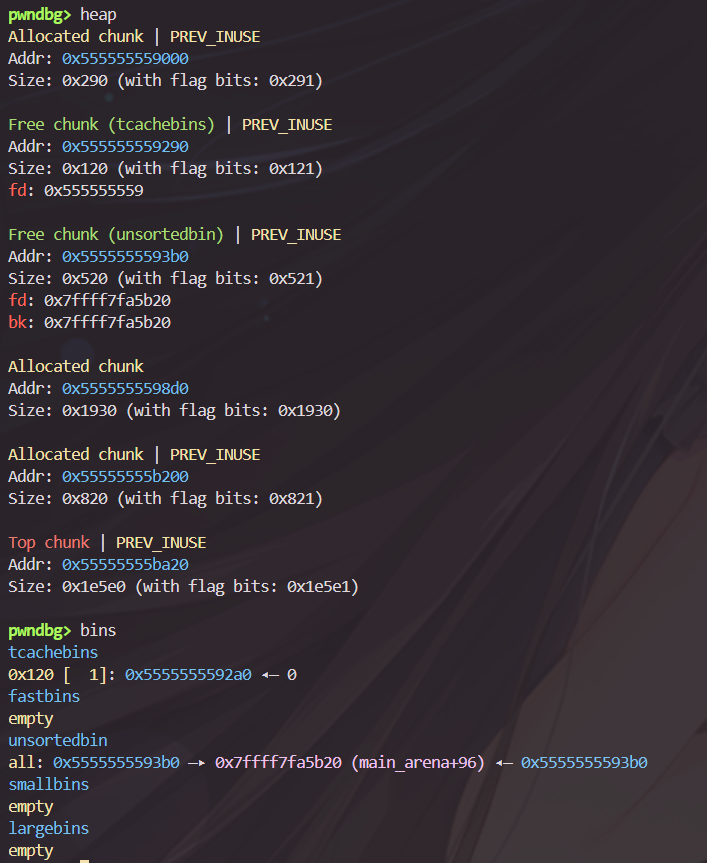
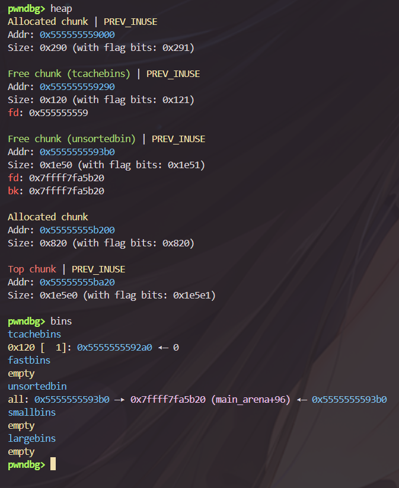
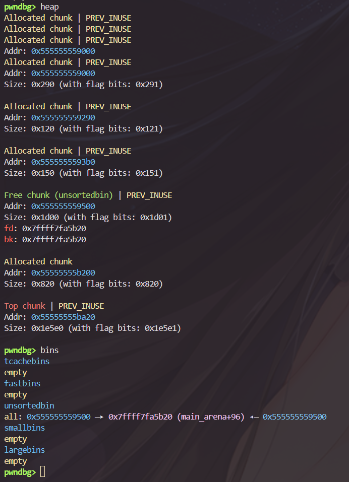

## 前言

请确保在已经学习并掌握了常见栈漏洞的前提下阅读本文。

对于堆的学习，libc 版本是非常重要的，**heap 的特性与 libc 版本相关性极强**，而很多人（包括我）可能都会使用 kali-linux，可能有些大神学会了使用 pwn docker 一类神奇小工具，请教我。

对于 glibc 这种依赖性很强的东西，贸然降级是十分危险的，所以这里介绍 `glibc-all-in-one` 和 `patchelf`。

* glibc-all-in-one 是一个开源脚本集合，它的唯一作用就是帮你下载提取好各个版本、各个架构的 libc 文件和 ld（动态链接器）。
  * 建议在 wsl 的根目录或 tools 下载
  * `git clone https://github.com/matrix1001/glibc-all-in-one.git`
  * 进入文件夹后给脚本运行权限 `chmod +x update_list`
  * 记得经常拉取最新的可用 libc 列表`./update_list`

* patchelf 是一个用来修改现有 ELF 可执行文件元数据的工具。
  * 修改动态链接器 `patchelf --set-interpreter /你的路径/glibc-all-in-one/libs/2.27-3ubuntu1_amd64/ld-2.27.so ./heap_test`
  * 修改库搜索路径 `patchelf --set-rpath /你的路径/glibc-all-in-one/libs/2.27-3ubuntu1_amd64/ ./heap_test`
  * ldd 命令查看程序依赖状态 `ldd ./heap_test`

对于不同的 glibc，其 heap 特性简介如下
 
 Glibc 版本 (典型操作系统) | 堆特性与核心保护机制 | 在 CTF 中的地位 |
| --- | --- | --- |
| **2.23**(Ubuntu 16.04) | 没有 Tcache。主要围绕 Fastbin 和 Unsorted Bin 展开。 | 新手村。它是理解堆布局、学习经典 Unlink 和 House 系列攻击的基石。 |
| **2.27**(Ubuntu 18.04) | 首次引入 Tcache，且**没有任何保护**。 | 曾经的主流。因为 Tcache 没有 Double Free 检查，各种任意地址分配如入无人之境。 |
| **2.29 - 2.31**(Ubuntu 20.04) | Tcache 引入了 `key` 字段检查，彻底杀死了简单的 Tcache Double Free。 | 当前中等难度赛事的主流。需要利用更复杂的机制（如 Tcache Stashing Unlink）来绕过保护。 |
| **2.32 - 2.35+**(Ubuntu 22.04/24.04 及更高) | 引入 **Safe-Linking（指针混淆）**，直接加密了链表指针。并且移除了 `__malloc_hook` 和 `__free_hook**`。 | 传统的劫持 hook 方法失效，逼迫选手去研究更复杂的 `_IO_FILE` 结构劫持或 ROP 链构造。 |

使用环境 ：wsl kali linux。

```
PRETTY_NAME="Kali GNU/Linux Rolling"
NAME="Kali GNU/Linux"
VERSION_ID="2025.3"
VERSION="2025.3"
VERSION_CODENAME=kali-rolling
ID=kali
ID_LIKE=debian
HOME_URL="https://www.kali.org/"
SUPPORT_URL="https://forums.kali.org/"
BUG_REPORT_URL="https://bugs.kali.org/"
ANSI_COLOR="1;31
```

由于本篇学习日志大多边学边写，所以难免出现以下情况：

* 多变的代码风格
* 无力的叙述语言
* 半对半错的理解
* 效率低下的调试

请见谅，如有错误请指出。

---

## 堆的基本认识

我们以 `heap_text.c` 展示堆的相关调试信息：

```
#include <stdio.h>
#include <stdlib.h>

int main() {
    void *chunk1 = malloc(0x114); 
    void *chunk2 = malloc(0x514); 
    void *chunk3 = malloc(0x1919); 
    void *guard = malloc(0x810); 
    free(chunk1);
    free(chunk2);
    free(chunk3);
    void *reborn1 = malloc(0x118);
    void *reborn2 = malloc(0x139);
    return 0;
}
```

由于我的 libc 版本较高，所以非 **Glibc 2.23(Ubuntu 16.04)** 的信息将特别说明，请特别注意！

### 堆的基本概念

当我们运行一个程序时，操作系统会为我们分配一个空间，这个空间分为多个部分，其中就包含堆段和栈段。

与栈对比，**栈（stack）是由编译器自动管理（存放局部变量），而堆（Heap）则是供程序员动态分配的内存空间。**

当 heap_test 执行第一行 malloc(0x114) 结束后，我们可以清晰的看到其空间被严格划分为：



* **蓝色的堆段**：
  * 起始地址 `0x555555559000`，结束地址 `0x55555557a000`。
  * **大小为0x21000**。
  * 权限：`rw-p`（可读 read，可写 write，私有 private，**没有执行权限 x**）

* **红色的代码段**：
  * 权限：`r--xp`（不可写）

* **粉紫色的数据段**：
  * 程序自己的数据段结束地址是 ` 0x555555559000`，与 heap 段的起始位置相同，紧挨着 heap 段。
  * 权限：`rw-p`。
 
* **黄色的栈段**：
  * 权限：`rw-p`。

观察发现，栈的地址往往较大（`0x7ffff`开头），这是因为**栈的生长方向是 高地址 → 低地址**，而**堆的生长方向是 低地址 → 高地址**，其间留有巨大的空间给各种动态链接库。

**并且 heap 的大小（0x21000）远大于我们实际申请的大小（0x114）。**

### 堆的实现

#### 分配逻辑

堆之所以远大于我们申请的大小的原因是堆的管理机制，当下 linux 系统最主流的堆的管理机制是 Glibc 的 ptmalloc，为了高效管理，其引入了几个核心概念：

* Chunk（内存块）：当我们申请一块 0x20 大小的内存时，不会只给 0x20 个字节，**而是给一个包装过的结构，称为 chunk**，包含以下数据：
  * prev_size：前一个邻接 chunk 的大小。
  * size：当前 chunk 的大小。
  * user_data：真正给程序使用的数据区。

其中，**prev_size 的唯一作用是**，当当前 chunk 需要被释放时，系统将**计算前一个 chunk 的起始地址**并**检查查前一个邻接的 chunk 是否已经被释放**，如果被释放了，**那么系统将把这两个 chunk 合并（修改前一个 chunk 的头部信息）**，等待重新分配。

而**判断 chunk 是否被释放的主要依据是 P 位**。

在 64 位系统中，**chunk 的大小必须是 16 字节对齐的**。

这意味着**对于合法的 chunk，其 size 的二进制表示最后四位一定是 0000**。

既然这几位一定是 0，那么 glibc 就决定利用这些位置，**把最低的三位拿来当作状态标志位（Flags）**。

* A (NON_MAIN_ARENA)：是否属于主分配区
* M (IS_MMAPPED)：是否是通过 mmap 分配的超大块。
* P (PREV_INUSE)：最低的一位，记录**前一个邻接 chunk 的空闲状态**。

也就是说，如果 低地址 → 高地址 存在邻接的 chunk_1，chunk_2，chunk_3，**如果 chunk_1 正在被占用，那么 chunk_2 的 size 字段最低位就是 1**。

（注意：不是 prev_size，**prev_size 不存在 P 位**，仅仅是前一个 chunk 的大小，用来计算前一个 chunk 的起始地址）

所以，如果 chunk_1 被 free 了，那么系统就会立刻把 chunk_2 中 size 的 P 位改成 0。

这样的好处就是**当你释放当前 chunk 时，只要取当前 chunk 的 size&1 就可以得到是否要合并前一个 chunk 的信息**。

那么当 size 的 P 位为 1 时，意味着前一个 chunk_1 正在被使用，此时不能将 chunk_1 与 chunk_2 合并，**prev_size 作为计算 chunk_1 的起始位置而存在的信息是无意义的**，因此 glibc 会将 chunk_2 的 prev_size 划分给 chunk_1，该机制被称为**空间复用**。

这导致我们**得到的 chunk 大小往往等于申请的内存大小 + size（8 字节）向上取整（16字节对齐）**。

我们对 heap_test 这个程序举例，查看它的信息：



* 第一个 Allocated chunk 是现代 glibc 用来存放自己的 Tcache (Thread Local Cache) 管理块，当程序第一次调用 malloc() 的时候就会将其存放，用来加速内存分配，大小通常是 0x290。
  * 在 **Glibc 2.27(Ubuntu 18.04)** 加入，在 Glibc 2.23 中，用户申请的内存块直接占用 chunk 的一号位。
  * 作为第一个 chunk，**其 size 的 P 位必然为 1**，以防止堆越界。
* 第二个 Allocated chunk，即用户申请的内存：
  * 地址：0x555555559290
  * 大小 0x120（我们**申请了 0x114 + 0x8 = 0x11C 的内存，向上取整为 0x120**）
  * P 位为 1 表示其前一个邻接的 chunk （Tcache 管理块）正在使用。
* 第三个 Top chunk，在某些 pwn 博客里被称为荒野（wilderness），即**还没有使用的连续空间**。

当我们执行到 `void *guard = malloc(0x810); ` 时，heap_test 信息如图：



#### 释放逻辑

chunk 被释放后，其数据依然不会消失，只改变指针。

chunk 被释放时，如果 **邻接 Top chunk 且 chunk 大小并不是很小（即 tcachebins 和 Fastbins 优先）**，那么它就会被合并至 Top chunk，否则就会被按照要求放入 bins，而申请新内存时系统也优先看 bins。

* Fastbins：大小在 0x80 以下的 chunk，
  * **进入 Fastbins 的 Chunk 不会清零下一个块的 P 位**。
  * 数据结构：单向链表。
* Smallbins：大小在 0x80 到 0x3F0 的 chunk：
  * **这里的 Chunk，它的 P 位一定是 0。**
  * 数据结构：**双向循环链表，当里面只有一个 chunk 时，其向前指针 `fd` 与向后指针 `bk` 都会指向该链表的头节点（物理存在于 libc 的数据段，`main_arena` 结构体）**
* Largebins：大小大于等于 0x400 的 chunk。
  * 数据结构：**双向循环链表，同 smallbins，可能泄露 libc**。
* unsorted bins：缓冲区。
  * **当某个 chunk 被 free，优先进入 unsorted bins 等待“分拣”**，程序第二次执行 malloc 时，才会在 unsorted bins 进行遍历，**将完全等于要求大小的 chunk 重分配**，**将大小不同但是符合其他 bins 放入条件的 chunk 放到其他 bins**。
  * 数据结构：**双向循环链表，同 smallbins，可能泄露 libc**。
* tcachebins：在 **Glibc 2.27(Ubuntu 18.04)** 加入，大小 0x410 以下的 chunk 进入，**优先级比 Fastbins 还高**。
  * 与 Fastbins 相同，**进入 tcachebins 不会清空下一个块的 P 位**。
  * **对于每一种大小的 Chunk，Tcache 最多只能装 7 个**，因此大小在 0x80 以下的 chunk_8 及以后的 chunk 都会进入 fastbins。
  * 在 tcachebins 用尽 7 个相同大小的 chunk 后，会进入 fastbins 再次寻找，并转移至多 7 个 chunk 再到 tcachebins。
 
比如我们的 heap_test 执行到第一个 free 时：



如我们说的，第一个 chunk 进入了 tcachebins，chunk_2 的 p 位仍然为 1。

当 heap_test 执行到第二个 free 时：



可见 chunk_2 优先进入了 unsorted bins，**此时 chunk_3 的 p 位变成了 0**。

同时，unsorted bins 只有一个 chunk，其泄露了 libc：`0x7ffff7fa5b20 (main_arena+96)`，

当 heap_test 执行到第三个 free 时：



发现 0x520 + 0x1930 = 0x1e50，而 guard 的 p 位变成了 0。

#### 重分配逻辑

如上文中释放逻辑所说：

> 程序第二次执行 malloc 时，才会在 unsorted bins 进行遍历，**将完全等于要求大小的 chunk 重分配**，**将大小不同但是符合其他 bins 放入条件的 chunk 放到其他 bins**。

正是“先分拣，后分配”，使该机制复杂而高效，当我们执行 heap_test 到 `void *reborn2 = malloc(0x139);` 时：



可见 0x118 + 0x8 = 0x120 刚好等于 tcachebins 里的 chunk 大小，所以**直接拿来用**。

而没有 0x150 大小的 chunk 存在于 tcachebins 或者 unsortbins 中，**所以“先分拣”将 unsorted bins 的巨大 chunk 放入 largebins**，然后从 smallbins 往下一路检查没有找到相同大小的 chunk，于是在 largebins 里巨大的 chunk 上切割下 0x150 大小的内存，然后**把被切割的 chunk 重新放回 unsortbins 等待再次“分拣”**。


